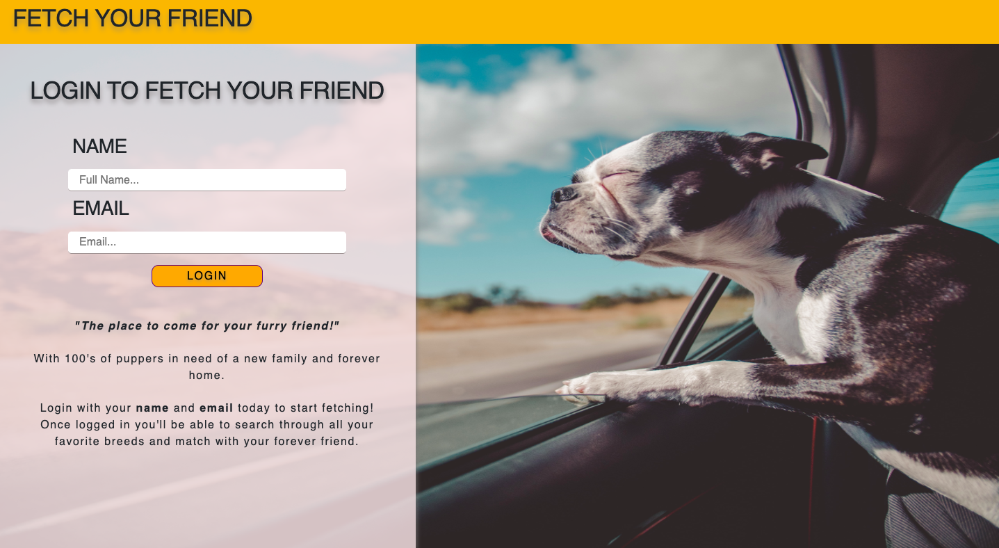
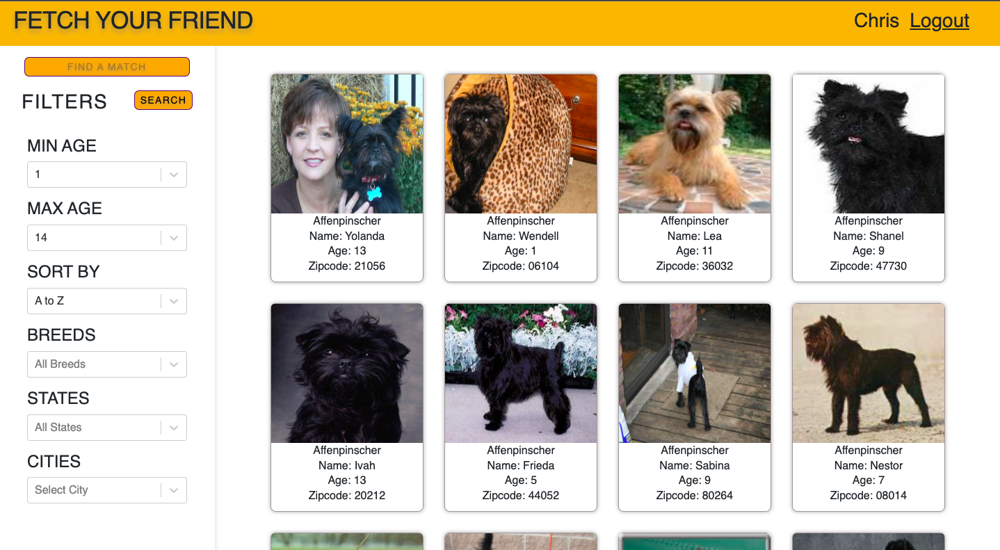
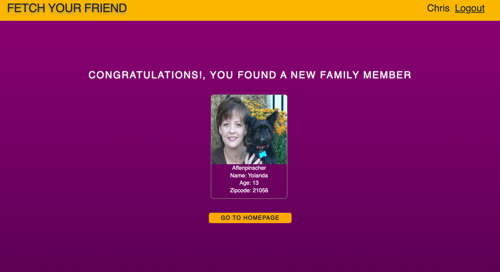

# Fetch API - Fetch your friend

Fetch API is an API built to help you fetch your best friend. The fetch API pulls in data from shelter homes all over the U.S. to help dog lovers all over fetch their best friend and help a dog in need. You can filter your results from different breeds, ASC to DSC, age and state/city allowing you to find the perfect match. Once you have narrowed your selection down, you will be able to select dogs that match you. After you have your selected dogs picked, you'll be able to click the MATCH button and it will match you with your best friend out of the selected dogs. Fetch API is built on Vite React and uses React-Router and React-Bootstrap to help run.

## Live Site

View live site here: [https://fetchafriend.netlify.app]

## Run Locally

To install this application you need
(Node JS 16.0 or above)[https://nodejs.org/en/download/]

Clone the project

```bash
  git clone https://github.com/Chrisfoehser2/fetchAPI-TypeScript
```

Go to the project directory

```bash
  cd fetchAPI-TypeScript
```

Install dependencies

```bash
  npm install
```

Start the server

```bash
  npm run dev
```

## Documentation

Once installed and running:

1. First login in with your and email, after submitting your name and email you will be directed to the homepage.
2. Select your preferred filters: Breed, ASC to DSC order, Age, State & City.
3. Next click search to filter your preferred selection.
4. Then select your favorite dogs by clicking on the cards.
5. Last after you have selected all your favorite dogs, click the MATCH button on the top left hand corner to fetch your new best friend. The MATCH feature will match you with your best friend out of your selected dogs.

## API Reference

For more information on the API and how it work here is the documentation on it: [https://frontend-take-home.fetch.com/]

## Screenshots




